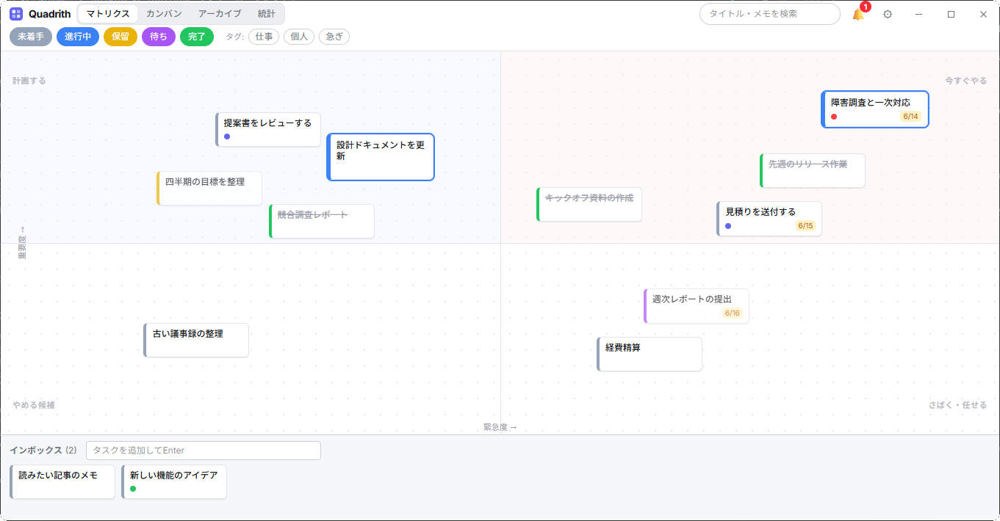
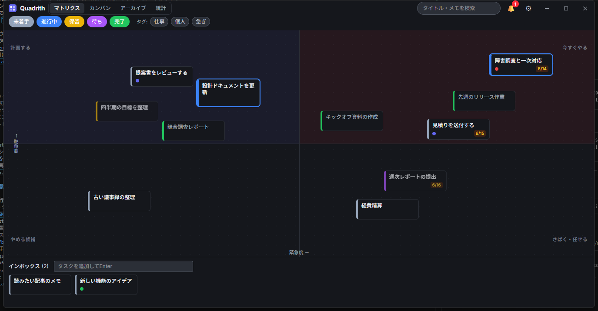

# Quadrith

重要度・緊急度・状態の3軸でタスクを管理する Windows 向けデスクトップアプリ。
アイゼンハワーマトリクスの「どれからやるか」と、カンバンの「どこまで進んだか」を1画面で扱う。

> A Windows desktop task manager that arranges tasks on an importance × urgency matrix,
> with status as the third axis (color + filter). Built with Tauri 2 + React.



<details>
<summary>ダークテーマ</summary>



</details>

📖 **使い方**: [doc/manual.md](doc/manual.md)（ユーザーマニュアル）
🛠 **開発者向け**: 仕様 [doc/requirements.md](doc/requirements.md) / 設計 [doc/design.md](doc/design.md)

## インストール

[Releases](../../releases) から最新の `Quadrith_x.y.z_x64-setup.exe` をダウンロードして実行してください。
**管理者権限は不要**です（ユーザー単位インストール: `%LOCALAPPDATA%\Quadrith`）。

> ⚠️ 初回起動時に Windows SmartScreen の **「Windows によって PC が保護されました / 認識されないアプリ」**
> という警告が出ることがあります。これはアプリにコード署名をしていないためで、ウイルスではありません。
> その場合は **「詳細情報」→「実行」** をクリックすると起動できます。

## 技術スタック

Tauri 2.x / React 18 + TypeScript / Zustand / Tailwind CSS v4 / SQLite (tauri-plugin-sql)
フォントは Inter + Noto Sans JP を `@fontsource` でオフライン同梱（外部通信なし）。

## 主な機能

**マトリクス & 配置**
- ドラッグで任意位置に配置 → 正規化座標(0.0〜1.0)で即時保存
- カード重なりの衝突回避レイアウト(決定的・黄金角スパイラル)、4枚以上は「+N」クラスタに集約
- インボックスレーン(未仕分けタスクの受け皿)、双方向ドラッグで仕分け/差し戻し

**タスク編集**
- CRUD + 削除の Undo トースト(論理削除、30日後に起動時物理削除)
- 5状態の色分け・フィルタ(未着手/進行中/保留/待ち/完了)
- 期限日・タグ・メモ(Markdown 対応)・再確認日、カード右クリックメニュー

**ビュー**
- マトリクス / カンバン(列間ドラッグで状態変更) / 繰り返し / アーカイブ・ごみ箱 / 統計
- タグ絞り込み・タイトル/メモ検索(一覧系ビュー共通)
- 完了 → 既定24時間後にマトリクスから自動退避(アーカイブ判定は表示時計算)

**定期タスク(繰り返し)**
- ひな型(毎日 / 毎週・曜日指定 / 毎月・日付指定 / 毎年、N間隔)を登録 → 発生日に通常タスクを自動生成
- 固定スケジュール型。未起動で複数回該当しても「まとめて1件」に集約、未完了の実体があれば重複生成しない
- 生成タスクはひな型の象限・タグを継承し、通知・統計・アーカイブにそのまま乗る(🔁 アイコン表示)
- 詳細パネルの🔁ボタン(モーダル)でタスクをひな型化 / 専用ビューで一覧・停止/再開・編集・削除

**リマインド & 通知**
- 期限 / 再確認日 / 第2領域(重要×非緊急)の放置 を1リストに集約(ヘッダーのベル)
- 期限・再確認日は指定時刻(既定 9:00)に Windows トースト通知

**データ**
- SQLite。DBは任意のパス(Dropbox 等)に変更可能 → 簡易バックアップ・複数台持ち回り
- 起動時の自動バックアップ(3世代)+ 設定画面からの手動バックアップ(`VACUUM INTO`)
- JSON / CSV エクスポート + Redmine 取込用 CSV(期間指定・繰り返し展開・マッピング設定)
- スキーママイグレーション基盤(`PRAGMA user_version`、現行 v4)

**運用 / 堅牢性**
- システムトレイ常駐、グローバルホットキーでのクイック追加、Windows 起動時の常駐(autostart)
- 多重起動防止(2つ目は既存ウィンドウをフォーカス)
- DB未検出 → リカバリダイアログ / DB破損・マイグレーション失敗 → バックアップ復元画面
- ウィンドウ位置・サイズの記憶(モニタ外なら中央へ復帰)

**操作性**
- コマンドパレット(Ctrl+K): ビュー移動・タスク検索ジャンプ・選択中への操作・新規作成をキーボードで
- 複数選択(Ctrl/⌘+クリック)+ 一括操作(状態変更・タグ付け/外し・インボックスへ・削除、1回でUndo)

**UI**
- 高密度プロツール志向(Linear 風)・インディゴアクセント・ライト/ダーク両対応
- カスタムタイトルバー(枠なし) / 主要オーバーレイにグラス効果

> 機能の実装フェーズ履歴は [design.md §10](doc/design.md)、要件と対応状況は
> [requirements.md §5](doc/requirements.md) を参照。

## デザイン

配色は [src/index.css](src/index.css) の `@theme` で Tailwind の slate/blue ランプ・影・フォントを
一括再定義しており、各コンポーネントの既存ユーティリティクラスのまま全体の見た目を切り替えている
(ステータス5色はユーザー設定値なので独立)。
テーマはクラス方式(`html.dark`)+ `color-scheme`、システム連動はメディアクエリ監視。

**カスタムタイトルバー**: メインウィンドウは `decorations: false`(枠なし)。ヘッダー自体が
タイトルバーを兼ね、ロゴ・ビュータブ・検索・ウィンドウ操作(最小化/最大化/閉じる)を1本に統合
([WindowControls.tsx](src/components/common/WindowControls.tsx))。`data-tauri-drag-region` で
ドラッグ移動、[ResizeHandles.tsx](src/components/common/ResizeHandles.tsx) で縁リサイズを保証。
閉じるは OS と同じ経路(`closeToTray` 判定)を通る。アプリアイコンはヘッダーロゴと同一デザイン。

## 開発

```sh
npm install          # 依存関係のインストール
npm run tauri dev    # 開発実行(初回は Rust のビルドに数分)
npm test             # 単体・結合テスト(vitest)
npm run build        # フロントエンドの型チェック + ビルド
npm run tauri build  # 配布用ビルド
```

- テストは純粋関数(coords / layout / quadrant / reminders / stats / export / redmineExport /
  switchPlan / windowClamp / recurrence)に加え、マイグレーション SQL を **better-sqlite3** のインメモリDBで検証。
- ディレクトリ構成は [design.md §2](doc/design.md) を参照。
- アイコン変更時は差分ビルドだと再埋め込みされないことがある。`cargo clean -p quadrith
  --manifest-path src-tauri/Cargo.toml` 後に再ビルドする。

## 設計上のポイント(設計書からの意図的な差異)

- **マイグレーションは TS 側で実行**([src/lib/migrations.ts](src/lib/migrations.ts))。
  plugin-sql の Rust 側マイグレーションは接続文字列単位の静的登録で、ユーザーが任意に変更できる
  DBパスに追従できないため。`PRAGMA user_version` を TS で管理する。
- **任意パスのファイル I/O は Rust 側コマンドに集約**([src-tauri/src/fsops.rs](src-tauri/src/fsops.rs))。
  DB は Dropbox 等の任意の場所に置けるが、plugin-fs はスコープが appdata 等に限定されるため、
  バックアップ・DBパス切替・エクスポートのファイル操作は `std::fs` で行う(パス選択は dialog)。
- **バックアップは2種**([src/lib/backup.ts](src/lib/backup.ts))。起動時は DB を開く前
  (WAL 非接続)なので単純コピー、手動は load 後なので `VACUUM INTO`。世代数・保存先・テーマは
  DB を開く前に必要なため settings.json にもミラーする。
- **クイック追加は専用ウィンドウ**(label: `quickadd`)。DB に触れず、イベントでメインへ追加を
  委譲して同一DBへの2接続を避ける。メインと同じバンドルを [main.tsx](src/main.tsx) でラベル振り分け。
- **使用プラグイン**: sql / store / fs / dialog / global-shortcut / notification / opener /
  autostart / single-instance(+ tauri 本体の tray-icon)。

## データ保存先

| 内容                 | 場所                                                                          |
| -------------------- | ----------------------------------------------------------------------------- |
| ブートストラップ設定 | `%APPDATA%/com.quadrith.app/settings.json`(dbPath・ウィンドウ・一部ミラー)    |
| タスク DB            | 既定 `%APPDATA%/com.quadrith.app/tasks.db`(設定画面から任意の場所へ変更可能)  |
| 自動バックアップ     | 既定は DB と同じフォルダの `backups/tasks_YYYYMMDD_HHMMSS.db`(設定で変更可能) |
